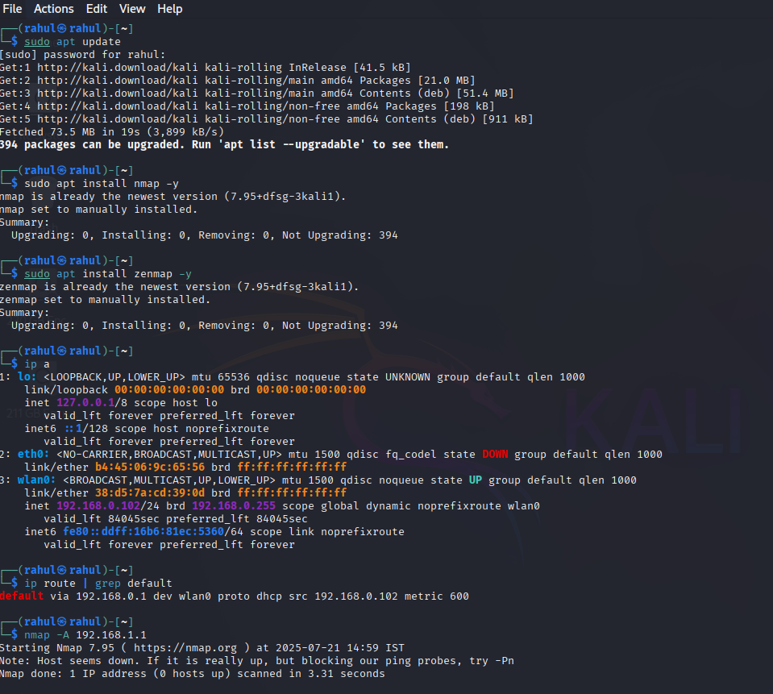
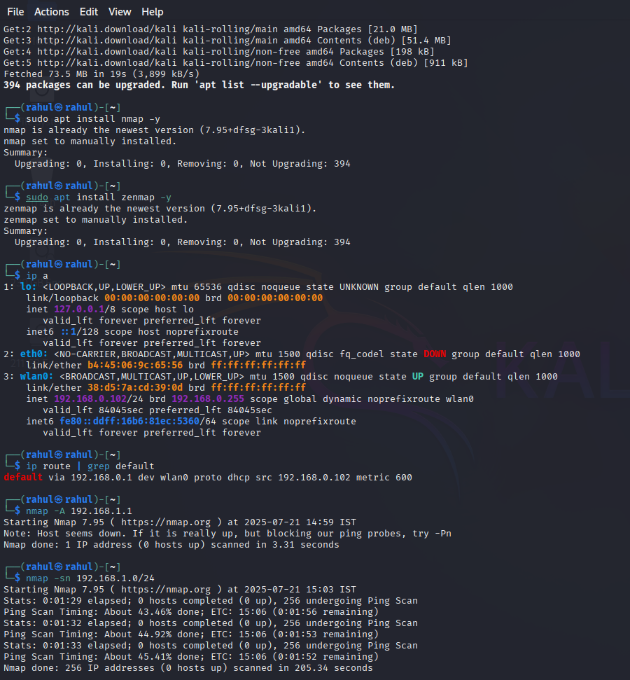

# 🚀 Network Scanning Procedure using Nmap

This guide outlines a step-by-step approach for beginners to perform a network scan using **Nmap** in **Linux** (especially Kali Linux). It helps identify active devices, open ports, running services, and potential vulnerabilities on a local network.

---

## ⚙️ Lab Setup Instructions

1. Install **VirtualBox** or **VMware Workstation** on your host machine.
2. Download the required virtual machines:

   * [Kali Linux](https://www.kali.org/get-kali/)
   * 
3. Configure a **Host-Only Network Adapter** and assign it to both VMs.
4. Ensure both machines are on the same subnet (e.g., `192.168.1.1/24`).
5. Confirm network connectivity using:

```bash
ping 192.168.56.101
```

---

## 🔹 Step 1: Identify Your IP and Gateway

Use the following commands to check your own system's IP and default gateway:

```bash
ip a
ip route | grep default
```

**Example:**

- IP Address: `192.168.1.5`
- Default Gateway (Router): `192.168.1.1`

---

## 🔹 Step 2: Basic Scan of a Target (Router)

Scan the router or any host to identify open ports, OS, and services.

```bash
nmap -A 192.168.1.1
```

This command performs:
- OS detection
- Port scanning
- Service and version detection
- Traceroute

---

## 🔹 Step 3: Discover Active Hosts on the Network

Scan your entire subnet (e.g., `/24`) to find live hosts:

```bash
nmap -sn 192.168.1.0/24
```

This returns a list of devices currently connected to the local network.

---

## 🔹 Step 4: Scan All Ports on a Host

Scan all 65535 TCP ports of a specific target:

```bash
nmap -p- 192.168.1.1
```

This gives a complete view of open ports beyond the default set.

---

## 🔹 Step 5: Vulnerability Scan (Optional)

Run basic vulnerability detection scripts:

```bash
nmap --script vuln 192.168.1.1
```

Note: This is a basic vulnerability check and not a full security audit.

---

## 🧾 Sample Output

```
PORT     STATE SERVICE VERSION
22/tcp   open  ssh     OpenSSH 7.9 (protocol 2.0)
80/tcp   open  http    Apache httpd 2.4.29
3306/tcp open  mysql   MySQL 5.7.24
MAC Address: 44:6D:57:AA:BB:CC (TP-Link Technologies)
OS details: Linux 3.10 - 4.11
```

---

## 📸 Screenshorts




___

## 🛡️ Risk Assessment & Recommendations

| Port | Service | Risk             | Recommendation                     |
|------|---------|------------------|------------------------------------|
| 22   | SSH     | Brute-force      | Use key-based authentication       |
| 80   | HTTP    | Plain-text data  | Use HTTPS & update web server      |
| 3306 | MySQL   | Data exposure    | Close or firewall this port        |

---

## ✅ Tools Required

- **Nmap** (Pre-installed in Kali Linux)
- Local network access
- Basic terminal skills

---

## 🙏 Acknowledgment

Special thanks to [Biswadeb Mukherjee](https://github.com/official-biswadeb941) for technical guidance and strategic input throughout this lab simulation. His expertise in offensive security, enumeration tactics, and adversarial tooling played a vital role in this project’s successful execution.


---

## 👨‍💻 Author

**Rahul (Linux Username: `rahul`)**  
Beginner Cybersecurity Enthusiast | Kali Linux User

---

## 📚 References

- [Nmap Official Docs](https://nmap.org/book/)
- [Nmap Cheat Sheet (PDF)](https://nmap.org/book/inst-windows.html)
- [Kali Linux Tools](https://tools.kali.org/)
